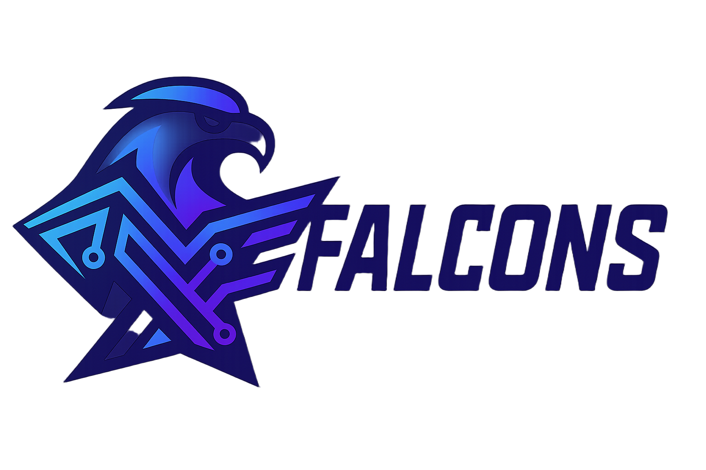

# Falcons Cybersecurity Community Website

Welcome to the official repository for the Falcons Cybersecurity Community website. This is Egypt's premier cybersecurity student community platform.

## 🚀 Live Website

Visit us at: [https://falcons-eg.tech](https://falcons-eg.tech)

## 📖 About

Falcons CIC (Cybersecurity Interest Community) is a student-driven initiative focused on:
- Building cybersecurity awareness and skills
- Creating a collaborative learning environment
- Organizing competitions, workshops, and events
- Connecting cybersecurity enthusiasts across Egypt

## 🛠️ Technology Stack

- **Frontend**: HTML5, CSS3, Vanilla JavaScript
- **Styling**: Tailwind CSS
- **Deployment**: Netlify
- **Domain**: Custom domain (falcons-eg.tech)

## 📁 Project Structure

```
falcons-cybersecurity/
├── index.html          # Home page
├── about.html          # About us
├── blog.html           # Blog posts
├── events.html         # Events and workshops
├── resources.html      # Learning resources
├── join.html           # Membership
├── 404.html           # Error page
├── _redirects         # Netlify redirects
├── assets/
│   ├── css/
│   │   └── style.css  # Custom styles
│   ├── images/        # Logo and media
│   └── js/
│       ├── main.js    # Core functionality
│       ├── animations.js
│       └── particles-config.js
└── game/
    └── index.html     # Cybersecurity game
```

## 🔧 Development

### Prerequisites
- Node.js (for development server)
- Git

### Local Development

1. Clone the repository:
```bash
git clone https://github.com/falcons-cic/website.git
cd website
```

2. Start a local server:
```bash
# Using Python
python -m http.server 8000

# Using Node.js (if you have live-server installed)
npx live-server

# Using PHP
php -S localhost:8000
```

3. Open your browser and navigate to `http://localhost:8000`

## 📱 Features

- **Responsive Design**: Fully optimized for mobile and desktop
- **Modern UI**: Clean, professional interface using Tailwind CSS
- **Interactive Elements**: Animations and particle effects
- **Cybersecurity Game**: Educational mini-game
- **SEO Optimized**: Proper meta tags and structured data
- **Fast Loading**: Optimized assets and minimal dependencies

## 🚀 Deployment

This website is automatically deployed to Netlify when changes are pushed to the main branch.

### Manual Deployment

1. Build the project (if needed)
2. Deploy to Netlify:
   - Connect your GitHub repository
   - Set build command: (none needed for static site)
   - Set publish directory: `/`
   - Configure custom domain: `falcons-eg.tech`

### Environment Setup

The site includes:
- Custom domain configuration
- 404 error handling
- Redirects configuration
- SEO optimization

## 🤝 Contributing

We welcome contributions from the community! Please follow these steps:

1. Fork the repository
2. Create a feature branch (`git checkout -b feature/amazing-feature`)
3. Commit your changes (`git commit -m 'Add amazing feature'`)
4. Push to the branch (`git push origin feature/amazing-feature`)
5. Open a Pull Request

### Code Style

- Use semantic HTML
- Follow Tailwind CSS conventions
- Write clean, commented JavaScript
- Ensure mobile responsiveness
- Test across different browsers

## 📞 Contact

- **Website**: [https://falcons-eg.tech](https://falcons-eg.tech)
- **Email**: info@falcons-eg.tech
- **LinkedIn**: [Falcons CIC](https://www.linkedin.com/company/falconscic)
- **GitHub**: [falcons-eg](https://github.com/falcons-eg)

## 📄 License

This project is licensed under the MIT License - see the [LICENSE](LICENSE) file for details.

## 🙏 Acknowledgments

- All Falcons community members
- Cybersecurity education advocates
- Open source contributors
- The broader cybersecurity community in Egypt

---

**Made with ❤️ by the Falcons CIC Team**

*Empowering the next generation of cybersecurity professionals in Egypt.*

A modern, interactive, and animated web application for the Falcons cybersecurity student community at Canadian International College (CIC).



## 🚀 Features

### 🎯 Core Pages
- **Home** - Dynamic hero section with cyberpunk aesthetics and animated features
- **About** - Team information, mission, and organizational structure
- **Events** - Upcoming cybersecurity events and workshops
- **Blog** - Cybersecurity articles, tutorials, and news
- **Resources** - Learning materials, tools, and certifications
- **Join** - Interactive application form for new members
- **Game** - Cyber Defense Command - Interactive cybersecurity quiz game

### 🎮 Interactive Game
- **Cyber Defense Command** - A network defense simulation game
- Real-time threat detection and response challenges
- Cybersecurity knowledge quiz integration
- Leaderboard system with local storage
- Progressive difficulty levels
- Mobile-responsive game interface

### 🎨 Design & Animation
- **Cyberpunk Theme** - Blue and purple gradient color scheme
- **Particles.js Background** - Dynamic animated particle system
- **Anime.js Animations** - Smooth entrance and scroll-triggered animations
- **Responsive Design** - Mobile-first approach with TailwindCSS
- **Accessibility** - WCAG compliant with focus states and reduced motion support

### 🔧 Technical Features
- **Modern Web Stack** - HTML5, CSS3, JavaScript ES6+
- **Animation Libraries** - Anime.js for smooth animations
- **UI Framework** - TailwindCSS for responsive design
- **Performance Optimized** - Lazy loading and device-specific optimizations
- **Cross-Browser Compatible** - Works on all modern browsers

## 🛠️ Installation & Setup

### Local Development
1. Clone or download the project
2. Navigate to the project directory
3. Start a local server:

```bash
# Using Python 3
python3 -m http.server 8080

# Using Node.js (if you have http-server installed)
npx http-server -p 8080

# Using PHP (if installed)
php -S localhost:8080
```

4. Open your browser and visit `http://localhost:8080`

### Deployment Options

#### GitHub Pages
1. Upload the entire project to a GitHub repository
2. Go to Settings > Pages
3. Select source as "Deploy from a branch"
4. Choose `main` branch and `/ (root)` folder
5. Your site will be available at `https://username.github.io/repository-name`

#### Netlify
1. Drag and drop the entire project folder to [Netlify](https://netlify.com)
2. Or connect your GitHub repository for automatic deployments
3. Your site will be live immediately with a generated URL

#### Vercel
1. Install Vercel CLI: `npm i -g vercel`
2. Run `vercel` in the project directory
3. Follow the setup prompts

## 📁 Project Structure

```
falcons-cybersecurity/
├── index.html              # Home page
├── about.html              # About page with team info
├── events.html             # Events and workshops
├── blog.html               # Cybersecurity blog
├── resources.html          # Learning resources
├── join.html               # Membership application
├── game/
│   └── index.html          # Cyber Defense Command game
├── assets/
│   ├── css/
│   │   └── style.css       # Custom cyberpunk styling
│   ├── js/
│   │   ├── main.js         # Core functionality
│   │   ├── animations.js   # Animation system
│   │   └── particles-config.js # Particle background
│   └── images/
│       ├── logo-new.png    # Original logo
│       ├── logo-full.png   # Full horizontal logo
│       ├── logo-mini.png   # Mini social media logo
│       └── founder-photo.jpg # Founder's photo
└── README.md               # This file
```

## 🎯 Game Instructions

### Cyber Defense Command
1. **Start Defense** - Begin monitoring your network
2. **Threat Detection** - Watch for red threat indicators on network nodes
3. **Response** - Click threatened nodes to answer security questions
4. **Secure Networks** - Correct answers secure nodes (green)
5. **Prevent Breaches** - Incorrect answers result in compromised nodes (red)
6. **Level Up** - Secure all nodes to advance to the next level
7. **Maintain Health** - Keep network security above 0%

#### Question Categories
- **Social Engineering** - Phishing, social attacks
- **Network Security** - Firewalls, protocols, ports
- **Web Security** - SQL injection, XSS, OWASP
- **Cryptography** - Encryption, hashing, certificates
- **Vulnerability Management** - Zero-days, patches
- **Authentication** - Multi-factor, biometrics
- **Penetration Testing** - Ethical hacking, tools

## 🎨 Customization

### Colors
The cyberpunk color scheme uses:
- **Primary Blue**: `#00f5ff` (Cyber Blue)
- **Primary Purple**: `#8a2be2` (Cyber Purple)
- **Dark Background**: `#0a0a0a` (Cyber Dark)
- **Secondary Gray**: `#1a1a1a` (Cyber Gray)

### Fonts
- **Headers**: Orbitron (Futuristic monospace)
- **Body Text**: Exo 2 (Clean sans-serif)

### Animations
All animations use Anime.js and can be customized in `assets/js/animations.js`:
- Hero entrance animations
- Scroll-triggered animations
- Hover effects
- Navigation animations
- Performance optimizations for mobile devices

## 📱 Responsive Design

The website is fully responsive with breakpoints at:
- **Desktop**: 1024px and above
- **Tablet**: 768px - 1023px  
- **Mobile**: 640px - 767px
- **Small Mobile**: Below 640px

### Mobile Optimizations
- Reduced particle effects for performance
- Touch-friendly navigation
- Optimized font sizes
- Simplified animations for low-end devices

## ♿ Accessibility Features

- **Keyboard Navigation** - Full tab navigation support
- **Focus Indicators** - Clear visual focus states
- **High Contrast** - Support for high contrast mode
- **Reduced Motion** - Respects user's motion preferences
- **Screen Reader** - Semantic HTML and ARIA labels
- **Color Contrast** - WCAG AA compliant color ratios

## 🚀 Performance Optimizations

- **Lazy Loading** - Images load only when needed
- **Hardware Detection** - Reduces animations on low-end devices
- **Mobile Optimizations** - Lighter particle effects on mobile
- **CDN Assets** - External libraries loaded from CDN
- **Minified Code** - Optimized for production

## 📊 Browser Support

- **Chrome** - Latest 2 versions
- **Firefox** - Latest 2 versions
- **Safari** - Latest 2 versions
- **Edge** - Latest 2 versions
- **Mobile Browsers** - iOS Safari, Chrome Mobile

## 🤝 Contributing

To contribute to this project:

1. Fork the repository
2. Create a feature branch
3. Make your changes
4. Test across different devices
5. Submit a pull request

### Development Guidelines
- Follow mobile-first responsive design
- Maintain cyberpunk aesthetic
- Ensure accessibility compliance
- Test animations on low-end devices
- Update documentation for new features

## 📞 Contact & Support

- **Email**: info@falcons-eg.tech
- **Organization**: Falcons CIC
- **Institution**: Canadian International College
- **Founded**: 2024

## 📄 License

This project is created for the Falcons cybersecurity student activity at Canadian International College. All rights reserved.

---

**Built with ❤️ by the Falcons team for the cybersecurity community at CIC**

*Soar high, secure the digital sky* 🦅🔒
